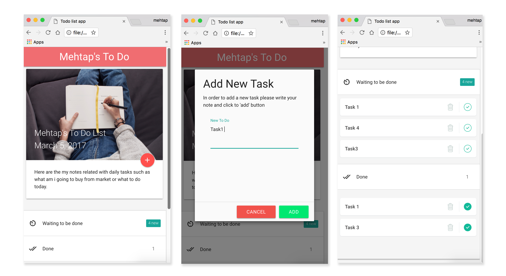

# Assignment 01

**TODO List**

## Submission Details
* In order to add new task inside to do list user should click on FAB and open a modal view. Here the functions are ‘add’, ‘cancel’ and putting multiple line inputs.
* Every new task is added before the previous list items.
* User can see her to do list under two categories as “Waiting to be done” and “Done”. 
* Every tasks is created with delete and check buttons. Delete button deletes the task, check button puts check mark on that task and push it under “Done” list. While the task is in “Done” list, clicking on the check button move the same task inside “waiting to be done” list.
* The two lists are embedded in Materialize Collapsible Badges as Expandable Collapsable.
* Materialize Image Card with FAB has been used as 12 columns to resize within whole page.
 
## Screens

## Personal Resources/Tutorials
* Max Sandelin’s To Do List Tutorial: https://www.youtube.com/watch?v=2wCpkOk2uCg
* John Balladares’s example: https://codepen.io/jaballadares/pen/Hwebq?editors=1111 
* How to trigger materialize modals: https://www.youtube.com/watch?v=sojeSrW8udQ
* https://www.w3schools.com

## Resources
* [Google Chrome Responsive Tools](https://developers.google.com/web/tools/chrome-devtools/device-mode/emulate-mobile-viewports)
* [Materialize CSS](http://materializecss.com/)
* [Semantic UI Kit](http://semantic-ui.com)
* [Twitter Bootstrap](http://getbootstrap.com/)
